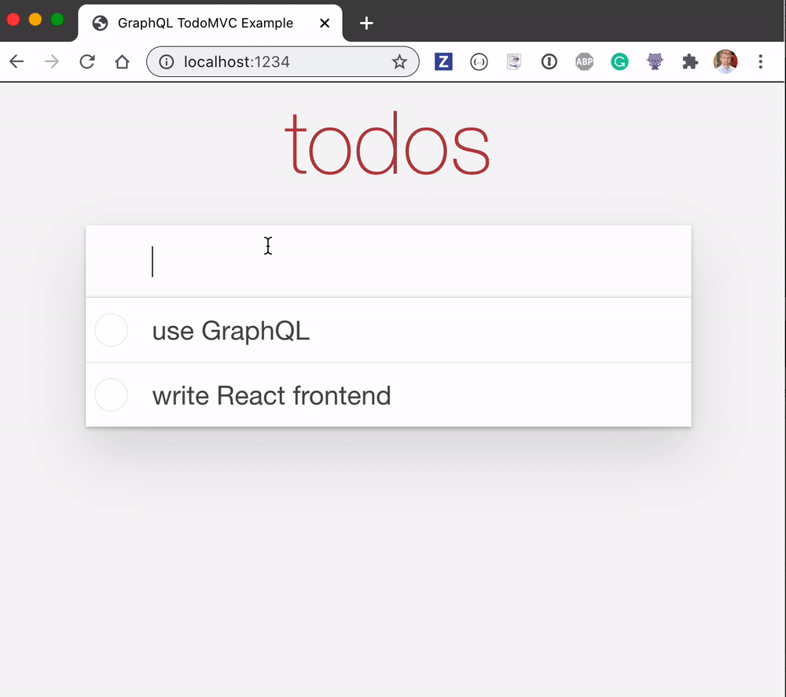

## Cypress tests

All tests are in the [cypress/integration](./cypress/integration) folder.

By mocking network calls using [cy.intercept](https://on.cypress.io/intercept) see the [intercept-spec.js](cypress/integration/intercept-spec.js) file.

Spec [client-spec.js](cypress/integration/client-spec.js) is testing making individual GraphQL calls using app's own client.

Spec [ui-spec.js](cypress/integration/ui-spec.js) has simple tests that do not depend on the network, and thus are hard to write.

We can use [cy.request](https://on.cypress.io/request) command to make GraphQL requests ourselves, see the [request-spec.js](./cypress/integration/request-spec.js) file.

We can stub the initial items load using a fixture file. See the spec file [fixture-spec.js](./cypress/integration/fixture-spec.js).

We delete all items in the [delete-spec.js](./cypress/integration/delete-spec.js) test. First we query all todo items, then delete them one by one.

We can import the list of items from a fixture file [cypress/fixtures/three.json](./cypress/fixtures/three.json) and create a dynamic test for each item, see the spec file [dynamic-spec.js](./cypress/integration/dynamic-spec.js).

## App

Start server with `npm start`. You can find GraphQL playground at `http://localhost:3000`



Example asking for all todos

```
query {
  allTodos {
    id,
    title,
    completed
  }
}
```

Response

```json
{
  "data": {
    "allTodos": [
      {
        "id": "1",
        "title": "do something",
        "completed": false
      },
      {
        "id": "2",
        "title": "another",
        "completed": false
      }
    ]
  }
}
```

Example creating new todo object

```
mutation {
  createTodo(id: 2, title: "another", completed: false) {
    id
  }
}
```

Response

```json
{
  "data": {
    "createTodo": {
      "id": "2"
    }
  }
}
```

Example asking for a single todo (notice `id` argument)

```
query {
  Todo(id: 2) {
    id,
    title,
    completed
  }
}
```

Response

```json
{
  "data": {
    "Todo": {
      "id": "2",
      "title": "another",
      "completed": false
    }
  }
}
```

## Development

Backend is [json-graphql-server](https://github.com/marmelab/json-graphql-server). Front-end React code is in [src](src) folder, modeled after [Getting Started With React And GraphQL](https://medium.com/codingthesmartway-com-blog/getting-started-with-react-and-graphql-395311c1e8da) post.

To start the applications and open Cypress

```shell
$ npm run dev
# starts the API, starts the web application
# when the application responds
# opens Cypress test runner
```

To start the application and run headless Cypress tests

```shell
$ npm run local
```

## Types

Look at [cypress/jsconfig.json](./cypress/jsconfig.json) that loads all 3rd party types, and includes the link to [cypress/support/index.d.ts](./cypress/support/index.d.ts) where I describe the type for custom command `cy.createTodos` defined in [cypress/support/index.js](./cypress/support/index.js).

